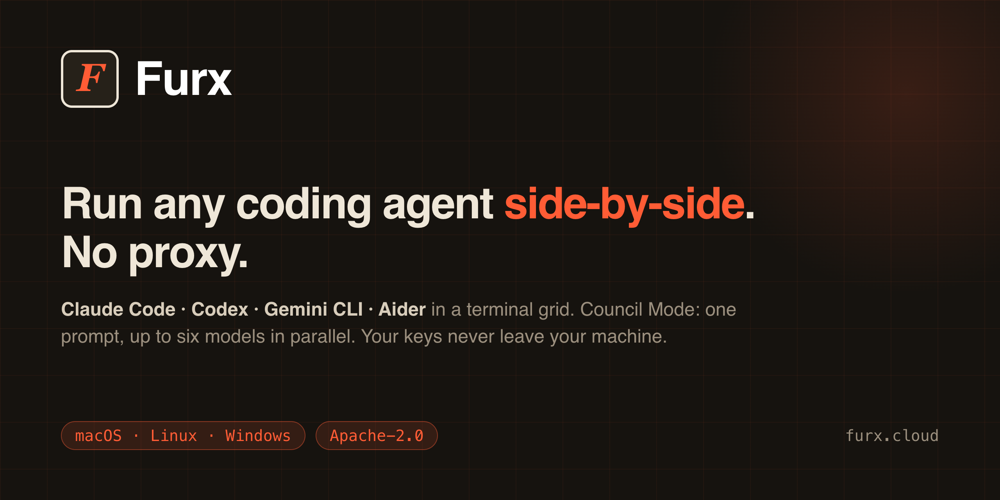

# Furx

[](https://github.com/hernaninverso/furx/actions/workflows/ci.yml) [](https://github.com/hernaninverso/furx/actions/workflows/release.yml)    

**Run any coding agent side-by-side. No proxy.**

Furx is a local-first desktop app that runs real coding agents — **Claude Code · Codex ·
Gemini CLI · Aider** — and any OpenAI-compatible endpoint, side by side in a grid of
terminal panes. Council Mode (⌘J) sends one prompt to up to six models in parallel and
synthesizes a consensus you can inspect. Your keys never leave your machine. No proxy.
The core is Apache-2.0 — read the source.



---

## Why Furx

Worktree orchestrators parallelize *tasks*. Model comparators put one prompt before N
models — but only as chat. Furx runs one prompt across many models **with real coding
agents in real terminals**, provider-agnostic.

- **Council fan-out** — one prompt → up to six models in parallel, with a synthesized
  consensus you can inspect. Competing answers on the same problem, not one model's
  first guess.
- **Real agents, not chat** — Furx runs the actual CLIs in terminals that read your repo,
  edit files, and run tests. Comparison tools show you chat; Furx shows you work.
- **Local & verifiable** — keys in the OS keychain, calls go direct to the provider, and
  an append-only audit log records what every agent did.

---

## Council Mode (⌘J)

Dispatch one prompt to up to six models at the same time. Furx collects every answer and
synthesizes a consensus, so you're not copy-pasting between tabs or betting a refactor on
a single model.

- **Five presets** — quick · cheapo · frontier · local · mix — plus templates and custom voices.
- **Live cost estimator** — see what a council run costs *before* you dispatch it.
- **History** — every council run is kept, with all answers and the synthesis.

The synthesis is inspectable: you see each voice's full answer next to the consensus.

---

## Your keys, your machine

**Your keys never leave your machine. No proxy.**

- **Keychain, not disk.** API keys are stored only in the OS keychain (macOS Keychain /
  Windows Credential Manager / libsecret) — never written to disk, never sent to a Furx
  server, never included in telemetry.
- **No proxy.** Every call goes straight from your machine to the provider you chose.
  Furx is never in the request path.
- **An audit trail the agent can't rewrite.** Audit events land in local SQLite with
  append-only protections — database triggers block `UPDATE` and `DELETE`.

Don't take the claims on faith: the core is Apache-2.0 — read the source.

---

## Quick start (30s)

```bash
# macOS (Apple Silicon) — DMG
curl -L https://github.com/hernaninverso/furx/releases/latest/download/Furx_aarch64.dmg -o ~/Downloads/Furx.dmg && open ~/Downloads/Furx.dmg

# Linux — DEB (or AppImage / RPM from the Releases page)
curl -L https://github.com/hernaninverso/furx/releases/latest/download/furx_0.2.0_amd64.deb -o /tmp/furx.deb && sudo apt install /tmp/furx.deb

# Windows — download furx_0.2.0_x64-setup.exe from the Releases page and run it.
```

First launch opens **Furx Connect** — add at least one provider (a free tier, OpenRouter,
a paid API, or local Ollama). Keys go to your OS keychain, never to disk in plaintext.
Then open a pane, pick an agent, and hit ⌘J to run your first council.

---

## Bring your own keys (BYOK)

Every model call goes straight from your machine to one of 15 supported providers — there
is no Furx-operated backend in the middle.

- **Free tiers** (one key each): Cerebras · Groq · Mistral · SambaNova · Google Gemini AI Studio.
- **One key, many models**: a $10 OpenRouter deposit unlocks 300+ models — the fastest way
  to run Council Mode with six distinct models.
- **Paid APIs**: Anthropic · OpenAI · Gemini (your own keys).
- **Local, no key**: Furx auto-detects Ollama (`:11434`), LM Studio (`:1234`), llama.cpp (`:8080`), vLLM.
- **Gateways**: any OpenAI-compatible endpoint (LiteLLM, your org's gateway).

Add or rotate keys in Settings → Providers.

---

## Core features — free, Apache-2.0

| | |
|---|---|
| **Multi-pane PTY grid** | shell + agent CLIs side by side, mix and match |
| **Council Mode** (⌘J) | one prompt to up to six models in parallel, then synthesis |
| **Append-only audit log** | SQLite, triggers block `UPDATE`/`DELETE` — tamper-evident |
| **Memory Hub** | local JSON-RPC daemon, FTS5 + embedding re-rank, shared across CLIs |
| **Skills registry** | `~/.furx/skills` + `~/.claude/skills` |
| **Command palette** (⌘K) + **search** (⌘P) | actions / projects / code / memories / git |
| **Broadcast** (⌘B) | one message to multiple panes |
| **MCP plugin host** | signed plugins, `tools/list` handshake + health status |
| **Voice → text** | whisper.cpp, model downloaded on demand |
| **Auto-update** | Ed25519-signed manifests (Tauri updater) |
| **BYOK engine** | 15 providers, keys only in the OS keychain |

Full feature reference: [`docs/features.md`](docs/features.md). The iOS companion
(read-only) is in [scaffolding](ROADMAP.md).

---

## Pricing & open-core

Furx is **open-core**: the whole tree is Apache-2.0; a few commercial features are gated by
a runtime license key whose check is visible in the source. **No feature is ever removed
from the free tier after being added.** See [`OPEN-CORE.md`](OPEN-CORE.md) for the exact boundary.

| Tier | Cost | Adds on top of the free core |
|---|---|---|
| **Free** | $0 forever | Everything above — all panes, all hotkeys, Council Mode, audit, memory, BYOK |
| **Pro** | $12 / mo | Cloud sync of `.mcp.json` + skills, session replay scrubber, Cost-Router auto-divert, cost meter, premium themes |
| **Team** | $30 / seat / mo | SSO/OIDC, admin console, shared cost dashboard, centralized audit |
| **Enterprise** | $49 / seat / mo · or $2.5k perpetual self-host | Notarized self-host build, data-residency, source-code escrow, white-label |
| **Compliance Pack** | $199 one-time | GDPR/DPA template, encrypted backup, legal escrow audit log |

14-day Pro trial on first install, no card. Billing via [Paddle](https://paddle.com)
(Merchant of Record). Details: [furx.cloud/pricing](https://furx.cloud/pricing).

---

## Architecture

```
furx/
├── web/             React 19 · Vite 6 · xterm 5.5  (UI)
├── src-tauri/       Rust · Tauri 2  (orchestrator, PTY, storage, ~60 service modules)
│   └── migrations/  ordered SQLite migrations
└── web-companion/   Next.js read-only audit replay (scaffolding)
```

Storage is local: `~/.furx/furx.db` (SQLite WAL, append-only `events`) and
`~/.furx/memory.db` (FTS5 + embeddings). Optional components (your own OpenAI-compatible
gateway, Ollama, the memory daemon) fail soft — if any is unreachable, Furx keeps running
on your own keys. Deeper notes: [`docs/architecture.md`](docs/architecture.md).

---

## Build from source

```bash
git clone https://github.com/hernaninverso/furx && cd furx
npm install
(cd src-tauri && cargo build --release)
npx tauri build --bundles app
```

Per-platform prerequisites (Xcode CLT / WebKitGTK / Windows SDK), environment overrides,
and the release process are in [`docs/build.md`](docs/build.md) and
[`CONTRIBUTING.md`](CONTRIBUTING.md). CI builds DMG + DEB + RPM + AppImage + MSI on every
`v*` tag.

---

## Contributing & community

Contributions of all sizes are welcome — see [`CONTRIBUTING.md`](CONTRIBUTING.md) (build,
tests, DCO sign-off, the open-core boundary). Be excellent to each other:
[`CODE_OF_CONDUCT.md`](CODE_OF_CONDUCT.md).

- **Bugs / features** — open an issue with the provided templates.
- **Questions / ideas** — GitHub Discussions.
- **Help & support policy** — [`SUPPORT.md`](SUPPORT.md).
- **Security** — please report privately, see [`SECURITY.md`](SECURITY.md).

Brand and copy guidelines for every public surface live in [`BRAND.md`](BRAND.md).

---

## License

Apache-2.0 — see [`LICENSE`](LICENSE) and [`NOTICE`](NOTICE), or **Settings → License** in
the running app. The core (orchestrator, panes, audit log, memory, BYOK) is free forever;
paid tiers are gated by a runtime license key whose check lives in the open source —
[`OPEN-CORE.md`](OPEN-CORE.md).

© 2026 INVERSO HUB S.R.L.
